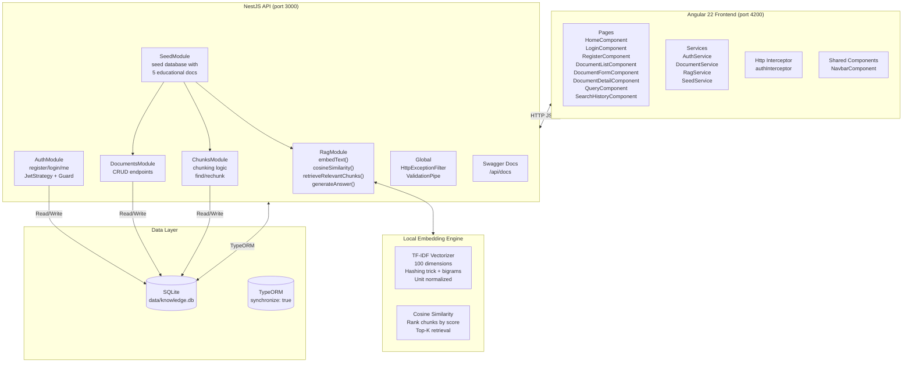

# Architecture

## System Diagram



## Data Flow

### Document Upload → Query → Answer

```
User Action           Frontend              Backend API            Database / Engine
───────────           ────────              ──────────            ─────────────────

── INGEST PIPELINE ─────────────────────────────────────────────────────────────

Upload/Paste      POST /documents       DocumentsController    INSERT documents
document          {title, content,      → DocumentsService     `documents` table
                  source}               → TypeORM save
                      │                       │
                      │                  ChunksController       Split words
                      │                  → rechunk()            into 500-word
                      │                       │                overlapping chunks
                      │                       ▼
                      │                  ChunksService          INSERT chunks
                      │                  → createChunks()       `chunks` table
                      │                       │
                      │                  RagService             For each chunk:
                      │                  → embedText()          hash words →
                      │                       │                hash bigrams →
                      │                       │                normalize vector
                      │                       ▼                UPDATE chunk
                      │                  → save embeddings      embedding column
                      │                       │
                      ▼                       │
                Response:                    │
                document                   Response:
                (no chunks                 chunks[]
                returned)

── QUERY PIPELINE ──────────────────────────────────────────────────────────────

Ask question      POST /rag/query        RagController         SELECT chunks
{question,        {question,             → retrieveRelevant    WHERE embedding IS
documentIds,      documentIds?,          Chunks()               NOT NULL
topK}             topK?}                       │
                      │                       ▼
                      │                  embedText(question)    100-dim vector
                      │                       │
                      │                  cosineSimilarity       Compare question
                      │                  (queryVec,             vector against
                      │                   chunkVec)             every chunk
                      │                       │
                      │                  Sort by score DESC     Top-K chunks
                      │                  Take topK              with scores
                      │                       │
                      │                  generateAnswer()       Build extractive
                      │                  → synthesizeAnswer     answer from
                      │                       │                top 3 chunks
                      ▼                       ▼
                Response:
                {question, answer,
                citations[{chunkId,
                  documentTitle,
                  excerpt, score}]}
```

## Why This Architecture?

### Monorepo with two applications
The project uses a flat monorepo structure (`apps/api` + `apps/web`) rather than a NestJS monorepo or Nx workspace. This keeps the dependency trees completely separate — the frontend doesn't inherit any backend packages, and vice versa. Each app manages its own `node_modules`, `package.json`, and build configuration. This is the simplest possible setup that still clearly separates concerns.

### Feature modules in NestJS
Each domain (auth, documents, chunks, rag, seed) is a self-contained NestJS module with its own controller, service, DTOs, and entity registration. This follows NestJS best practices and makes it easy to:
- Test modules in isolation
- Swap implementations (e.g., replace chunking strategy)
- Add new features without touching unrelated code

### No LLM dependency
The most deliberate architectural choice is using **local TF-IDF embeddings + extractive answer synthesis** instead of calling any external AI API. This means:
- Zero API keys required
- Zero cost to run
- Works fully offline
- Every answer is 100% grounded in uploaded documents
- The upgrade path to real LLMs is clearly scoped (swap two methods)

### SQLite for development, Neon-ready design
SQLite via `better-sqlite3` gives zero-config local development. The schema is designed so that migrating to Neon PostgreSQL with pgvector requires:
- Changing the TypeORM driver configuration
- Replacing the `embedding TEXT` column with a `vector(100)` column
- Using pgvector SQL operators instead of in-memory cosine similarity
- Everything else stays the same

### Signal-first Angular 22
The frontend uses Angular 22 with the new signal-based reactivity model throughout. All state is managed via `signal()` with `computed()` for derived values. There are zero `@Input()` or `@Output()` decorators — components receive data through services and route parameters. This aligns with Angular's recommended "zoneless" future.
