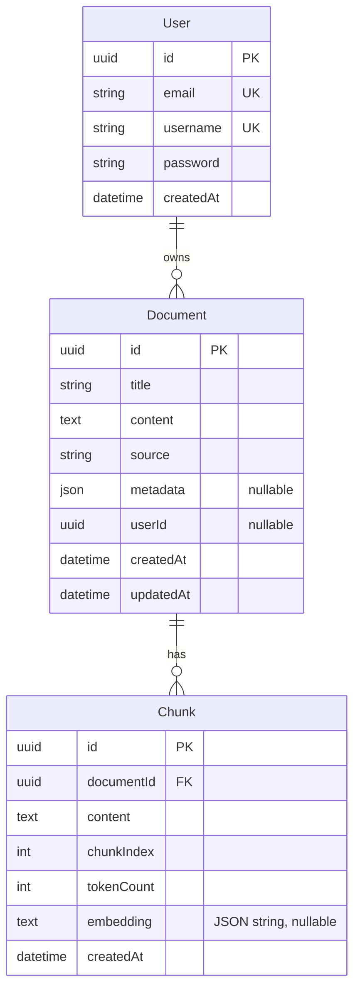

# Database

## Schema Overview

The database has three entities: **User**, **Document**, and **Chunk**. Embeddings are stored as JSON strings inside the Chunk entity (a design choice explained below).



## Entities

### User (`users` table)

```typescript
@Entity('users')
export class User {
  @PrimaryColumn('uuid')
  id: string;                    // crypto.randomUUID()

  @Column({ unique: true })
  email: string;                 // Unique login identifier

  @Column({ unique: true })
  username: string;              // Unique display name

  @Column()
  password: string;              // bcryptjs hash (10 rounds)

  @CreateDateColumn()
  createdAt: Date;
}
```

- **No `updatedAt`** — user profiles are immutable after creation
- **Password** stores the bcrypt hash, never the plaintext
- **UUID primary key** prevents enumeration attacks and supports distributed systems

### Document (`documents` table)

```typescript
@Entity('documents')
export class Document {
  @PrimaryColumn('uuid')
  id: string;

  @Column()
  title: string;

  @Column('text')
  content: string;               // Full document text

  @Column()
  source: string;                // 'upload' | 'paste' | 'url'

  @Column('simple-json', { nullable: true })
  metadata: Record<string, any>; // Flexible metadata JSON blob

  @CreateDateColumn()
  createdAt: Date;

  @UpdateDateColumn()
  updatedAt: Date;

  @Column({ nullable: true })
  userId: string;                // Future: owner reference
}
```

- **`userId`** is defined but not yet enforced — a placeholder for multi-user document isolation
- **`metadata`** uses TypeORM's `simple-json` transformer for automatic JSON serialization
- **Cascade delete** on chunks is handled at the database level

### Chunk (`chunks` table)

```typescript
@Entity('chunks')
export class Chunk {
  @PrimaryColumn('uuid')
  id: string;

  @Column()
  documentId: string;            // FK to documents

  @ManyToOne(() => Document, { onDelete: 'CASCADE' })
  @JoinColumn({ name: 'documentId' })
  document: Document;

  @Column('text')
  content: string;               // ~500 words of text

  @Column('int')
  chunkIndex: number;            // Position in original document

  @Column('int', { default: 0 })
  tokenCount: number;            // Actual word count

  @Column('text', { nullable: true })
  embedding: string;             // JSON.stringify(100-dim vector)

  @CreateDateColumn()
  createdAt: Date;
}
```

- **`embedding`** is stored as a JSON string (`TEXT` column) because SQLite has no native array/vector type. In production with Neon, this becomes a `vector(100)` column powered by pgvector.
- **`onDelete: 'CASCADE'`** means deleting a document automatically deletes all its chunks
- **`chunkIndex`** preserves document ordering for reconstruction
- **No `updatedAt`** — chunks are immutable; edits require re-chunking

## Migration Strategy

### Development (current)

```typescript
TypeOrmModule.forRoot({
  type: 'better-sqlite3',
  database: 'data/knowledge.db',
  entities: [__dirname + '/**/*.entity{.ts,.js}'],
  synchronize: true,            // Auto-creates tables from entities
  autoLoadEntities: true,
})
```

` synchronize: true` is acceptable for local development. TypeORM reads the entity decorators and generates `CREATE TABLE IF NOT EXISTS` statements automatically.

### Production (recommended)

```typescript
TypeOrmModule.forRoot({
  type: 'postgres',
  url: process.env.NEON_DATABASE_URL,
  entities: [__dirname + '/**/*.entity{.ts,.js}'],
  synchronize: false,           // Never auto-sync in production
  migrations: ['dist/migrations/*.js'],
  ssl: { rejectUnauthorized: false },
})
```

For production:
1. Generate migrations with `typeorm migration:generate`
2. Run migrations as part of CI/CD
3. For vector support, install pgvector extension: `CREATE EXTENSION vector;`
4. Change the `embedding` column type in the entity from `TEXT` to a custom vector type

#### Neon pgvector migration example

```sql
-- Requires: CREATE EXTENSION vector;
ALTER TABLE chunks ADD COLUMN embedding_vector vector(100);
UPDATE chunks SET embedding_vector = embedding::vector;
ALTER TABLE chunks DROP COLUMN embedding;
-- Create HNSW index for fast similarity search
CREATE INDEX idx_chunks_embedding ON chunks
  USING hnsw (embedding_vector vector_cosine_ops);
```

## Index Strategy

| Table | Column(s) | Index Type | Purpose |
|-------|-----------|------------|---------|
| `users` | `email` | UNIQUE (automatic) | Fast login lookup |
| `users` | `username` | UNIQUE (automatic) | Unique display name enforcement |
| `documents` | `userId` | B-tree (recommended) | Filter documents by owner |
| `chunks` | `documentId` | B-tree (implicit via FK) | Fast document → chunks queries |
| `chunks` | `embedding` | HNSW on pgvector (prod only) | ANN vector search |

## SQLite vs. Neon: Key Differences

| Aspect | SQLite (dev) | Neon / pgvector (prod) |
|--------|-------------|------------------------|
| Vector storage | `TEXT` (JSON string) | `vector(100)` native type |
| Similarity search | Userland cosine similarity in Node.js | SQL `ORDER BY embedding <=> $1` |
| Indexing | N/A (full scan over all chunks in memory) | HNSW or IVFFlat index |
| Concurrency | Single-writer, concurrent readers | Full PostgreSQL concurrency |
| Setup | Zero config | Requires Neon account + `CREATE EXTENSION vector` |
| Scaling | Single file, GB-range | Serverless, TB-range |

## Seed Data

The seed endpoint (`POST /seed`) clears existing data and inserts 5 educational documents:
1. **Angular Signals and Change Detection** (~1,500 words)
2. **NestJS Architecture Patterns** (~1,500 words)
3. **Neon PostgreSQL and pgvector** (~1,500 words)
4. **TypeScript Advanced Types** (~1,500 words)
5. **Machine Learning Basics** (~1,500 words)

Each document is chunked into ~3-4 chunks (500 words each, 50-word overlap), and each chunk gets a TF-IDF embedding computed and stored. The seed is idempotent — calling it multiple times replaces existing data.
